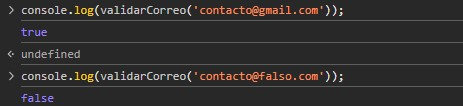
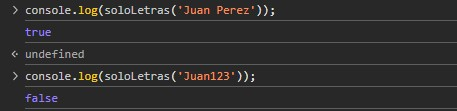
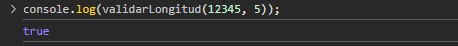
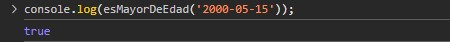
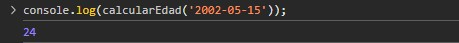

# A2-T2-Programacion-Web

# Utileria.js - Librería
**Actividad:** 2 tema 2   
**Materia:** Programación Web

## Problema que resuelve
Un archivo **js** que es una librería que contiene funciones en total 6 funciones obligatorias y 2 adicionales propias 
para validar y ser utilizadas en un formulario y login con html y css

## Instalación
Para utilizar **Utileria.js**, se debe tener el archivo `utileria.js`, y colocarlo en el proyecto dentro de `/js` e impórtalo en el `<head>` del html o antes de cerrar el `</body>`:
```html <script src="js/utileria.js"></script>```

## EJEMPLOS DE CODIGO EMBEBIDO
---
### 1. Validación de Correo con Dominios Permitidos
Valida el formato básico y restringe el registro únicamente a proveedores de correo válidos (`gmail`, `outlook`, `hotmail`, `yahoo`, `icloud`).
```
javascript
function validarCorreo(correo) {
    if (!correo) return false;
    const dominiosPermitidos = [
        'gmail.com',
        'outlook.com',
        'outlook.es',
        'hotmail.com',
        'yahoo.com',
        'icloud.com'
    ];
    const regexFormato = /^[^\s@]+@([^\s@]+\.[^\s@]+)$/;
    const coincidencia = correo.toLowerCase().trim().match(regexFormato);
    if (!coincidencia) return false;
    
    const dominioIngresado = coincidencia[1];
    return dominiosPermitidos.includes(dominioIngresado);
}

// Ejemplo de uso:
console.log(validarCorreo('contacto@gmail.com')); // true
console.log(validarCorreo('usuario@falso.com'));  // false
```


### 2. Validar Solo Letras
Comprueba que el texto contenga exclusivamente caracteres alfabéticos, acentos y espacios.
```
JavaScript
function soloLetras(texto) {
    if (typeof texto !== 'string' || texto.trim() === '') return false;
    const regex = /^[a-zA-ZáéíóúÁÉÍÓÚñÑ\s]+$/;
    return regex.test(texto);
}

// Ejemplo de uso:
console.log(soloLetras('Juan Perez')); // true
console.log(soloLetras('Juan123'));     // false
```


### 3. Longitud Máxima de Números
Verifica que un valor numérico no exceda la cantidad de dígitos permitidos.
```
JavaScript
function validarLongitud(numero, maxLongitud) {
    if (numero === null || numero === undefined || isNaN(numero)) return false;
    const strNumero = String(numero).trim();
    return strNumero.length <= maxLongitud;
}

// Ejemplo de uso:
console.log(validarLongitud(12345, 5)); // true
```


### 4. Cálculo de Edad y si es mayor de Edad
Determina los años cumplidos de un usuario a partir de su fecha de nacimiento y valida si tiene 18 años o más.
```
JavaScript
function calcularEdad(fechaNacimiento) {
    const nacimiento = new Date(fechaNacimiento);
    if (isNaN(nacimiento.getTime())) return NaN;

    const hoy = new Date();
    let edad = hoy.getFullYear() - nacimiento.getFullYear();
    const diferenciaMeses = hoy.getMonth() - nacimiento.getMonth();

    if (diferenciaMeses < 0 || (diferenciaMeses === 0 && hoy.getDate() < nacimiento.getDate())) {
        edad--;
    }
    return edad;
}

function esMayorDeEdad(fechaNacimiento) {
    const edad = calcularEdad(fechaNacimiento);
    return !isNaN(edad) && edad >= 18;
}

// Ejemplo de uso:
console.log(esMayorDeEdad('2000-05-15')); // true
```


### 5. Función calcularEdad
Calcula la edad en años enteros a partir de una fecha de nacimiento ingresada en formato AAAA-MM-DD.
```
JavaScript
function calcularEdad(fechaNacimiento) {
    const nacimiento = new Date(fechaNacimiento);
    if (isNaN(nacimiento.getTime())) return NaN;

    const hoy = new Date();
    let edad = hoy.getFullYear() - nacimiento.getFullYear();
    const diferenciaMeses = hoy.getMonth() - nacimiento.getMonth();

    if (diferenciaMeses < 0 || (diferenciaMeses === 0 && hoy.getDate() < nacimiento.getDate())) {
        edad--;
    }
    return edad;
}

// Ejemplo de uso:
console.log(calcularEdad('2002-05-15')); // Output: Edad en números
```


### 6. Función esMayorDeEdad
Determina si una persona tiene 18 años o más utilizando la función calcularEdad.
```
JavaScript
function esMayorDeEdad(fechaNacimiento) {
    const edad = calcularEdad(fechaNacimiento);
    return !isNaN(edad) && edad >= 18;
}

// Ejemplo de uso:
console.log(esMayorDeEdad('2000-01-01')); // Output: true
```


### 7. Formato Telefónico a 10 Dígitos
Convierte cualquier entrada numérica válida de 10 dígitos al estándar (XXX) XXX-XXXX.
```
JavaScript
function formatearTelefono(telefono) {
    if (!telefono) return '';
    const limpiado = String(telefono).replace(/\D/g, '');
    if (limpiado.length !== 10) return '';
    return `(${limpiado.slice(0, 3)}) ${limpiado.slice(3, 6)}-${limpiado.slice(6)}`;
}

// Ejemplo de uso:
console.log(formatearTelefono('5512345678')); // (551) 234-5678
```


### 8. Capitalización de Texto
Aplica formato de nombre propio convirtiendo la primera letra de cada palabra a mayúscula.
```
JavaScript
function capitalizarTexto(texto) {
    if (typeof texto !== 'string' || texto.trim() === '') return '';
    return texto
        .trim()
        .toLowerCase()
        .split(' ')
        .filter(palabra => palabra.length > 0)
        .map(palabra => palabra.charAt(0).toUpperCase() + palabra.slice(1))
        .join(' ');
}

// Ejemplo de uso:
console.log(capitalizarTexto('juan torres')); // Juan Torres
```


Capturas de pantalla (consola mostrando resultados)
Video corto (máx. 1 min): graba tu voz usando tu librería como si fuera un demo promocional, muestra el problema que resuelve, cómo se usa, y el resultado en acción (mensaje en consola, alerta, cambio en la página). No es solo "correr el código", es vender tu librería en 60 segundos.
